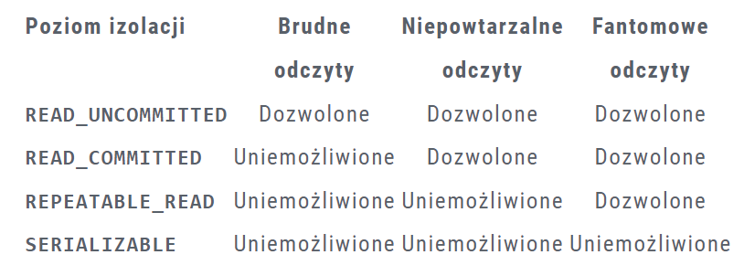

# Race condition

Zbiór przydatnych informacji na temat 'race condition' w javie i mechanizmy springowe ułatwiające pisanie kodu w 
środowisku wielowątkowym.

#### Spis treści

- [Multi-Threading && Spring transactions](#Multi-Threading-&&-Spring-transactions)
    - [Zarządzanie transakcją w JDBC](#Zarządzanie-transakcją-w-JDBC)
    - [Adnotacja @Transactional](#Adnotacja-@Transactional)
- [Dealing with Multi-Threading](#Dealing-with-Multi-Threading)
  - [Poziom izolacji](#Poziom-izolacji)
  - [Blokowanie Rekordów](#Blokowanie-rekordów)
    - [Pessimistic Locking](#Pessimistic-Locking)
    - [Optimistic Locking](#Optimistic-Locking)


### Multi-Threading && Spring transactions

##### Zarządzanie transakcją w JDBC

````
// nawiązanie połączenia z bazą danych
Connection connection = dataSource.getConnection();

try (connection) {
	// Po utworzenia połączenia z bazą, połaczenie to jest w trybie tzw. „automatycznego zatwierdzania”. Oznacza to, że każda pojedyncza instrukcja SQL jest traktowana jako jedna transakcja i jest automatycznie zatwierdzana zaraz po jej wykonaniu. Ustawienie flagi autoCommit na false pozwala na wykonanie więcej niż jednej instrukcji w ramach jednej transakcji.
	connection.setAutoCommit(false);

	// ...
	// operacje wchodzące w skład transakcji
	// ...

	// zatwierdzenie transakcji
	connection.commit(); 
} catch (SQLException e) {
	// wycofanie zmian w przypadku błędów 
	connection.rollback(); 
}
````

Transakcja to pewien zbiór operacji które muszą zostać wykonane kompleksowo (wszystkie lub żadna). Przykładem jest tu przelew bankowy,
podczas którego pieniądze muszą jednocześnie zostać odjęte z rachunku nadawcy, jak i dodane w tej samej kwocie do rachunku odbiorcy.
Tylko wtedy transakcja kończy się sukcesem. Jeśli któryś krok nie powiedzie się, wykonane zmiany zostaną cofnięte i stan systemu przywrócony do stanu sprzed rozpoczęcia transakcji.

##### Adnotacja @Transactional

Użycie tej adnotacji niekoniecznie chroni przed "sytuacją wyścigu". Przykład naszej metody do robienia przelewu pieniędzy z konta w `UserAccountService`:

````
    @Transactional
    public String transferMoney(MoneyTransferRequest transferRequest) throws InterruptedException {
        User sender = userRepository.findById(transferRequest.getSenderId()).orElseThrow(() -> new UserNotFoundException(
                "User with the id: " + transferRequest.getSenderId() + " doesn't exists in db"));
        User receiver = userRepository.findById(transferRequest.getReceiverId()).orElseThrow(() -> new UserNotFoundException(
                "User with the id: " + transferRequest.getReceiverId() + " doesn't exists in db"));
        if (sender.getAmountOfMoney() < transferRequest.getAmount()) throw new NotEnoughMoneyException("Not enough money");
        Thread.sleep(60000);
        sender.setAmountOfMoney(sender.getAmountOfMoney() - transferRequest.getAmount());
        receiver.setAmountOfMoney(receiver.getAmountOfMoney() + transferRequest.getAmount());
        return "Money was transferred successfully.";
    }
````
Jeśli po sprawdzeniu wujątku inny thread wyjmie pieniądze z bankomatu zmiana ta nie zostanie zarejestrowana i stan konta nie zostanie poprawnie zaktualizowany.
Dochodzi tu do problemu "Lost Update": Pierwsza transakcja pobiera dane, druga transakcja modyfikuje te same pobrane dane i zapisuje je. Pierwsza transakcja następnie modyfikuje i zapisuje wcześniej pobrane dane, które nie są już aktualne.
Koniec końców stan bazy danych jest nieprawidłowy. @Transactional nie pomaga, mimo że wykonuje operacje kompleksowo.

### Dealing with Multi-Threading

##### Poziom izolacji

Za pomocą parametru `isolation` w adnotacji `@Transactional` możemy ustawić poziom izolacji danej metody.
Wyróżniamy 4 typy izolacji:



Więcej tu: [Zarządzanie transakcjami](https://blog.consdata.tech/2022/01/25/transactions.html)

Aby rozwiązać nasz problem z Lost Update korzystamy z opcji REPEATABLE_READ aby uniknać tzw niepowtarzalnych odczytów=lost updatów
 `@Transactional(isolation = Isolation.REPEATABLE_READ)`

##### Blokowanie rekordów

Wyróżniamy tzw optimistic locking i pessimistic locking

###### Optimistic Locking

Używane kiedy mamy do czynienia ze znaczną przewagą odczytów. Optymistyczne blokowanie opiera się
na wersjonowaniu encji. Aktualnie przetwarzane zmiany na bazie danych nie zostają blokowane. Dzieje się
to dopiero przy zapisie. Jeśli transakcja próbuje zatwierdzać dane nieaktualne, zostanie zwrócony wyjątek `OptimisticLockException`.
Implementacja w Hibernate: Adontacja @Version, na przykład w encji:
````
@Version
private Long version
````

###### Pessimistic Locking
Realizowane na poziomie bazodanowym, nie na poziomie aplikacji. Dane blokowane są za każdym razem gdy
jakaś transakcja próbuje je odczytać lub modyfikować. Wyróżniamy:
````
LockMode.READ
LockMode.WRITE
LockMode.FORCE_INCREMENT
````
Więcej na ten temat tu:
https://javaleader.pl/2019/10/04/transkacje-jpa/